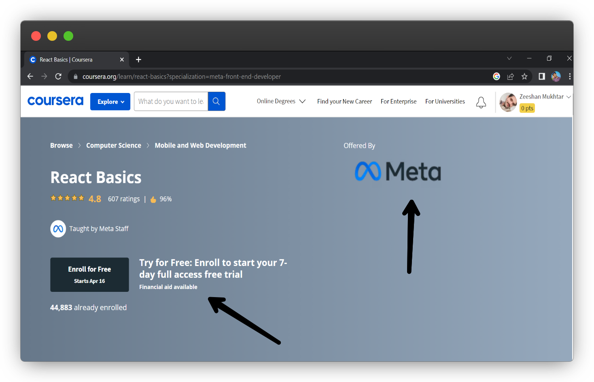
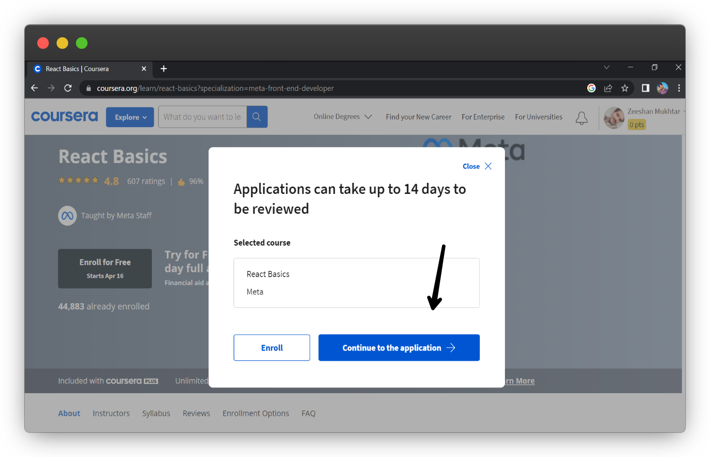
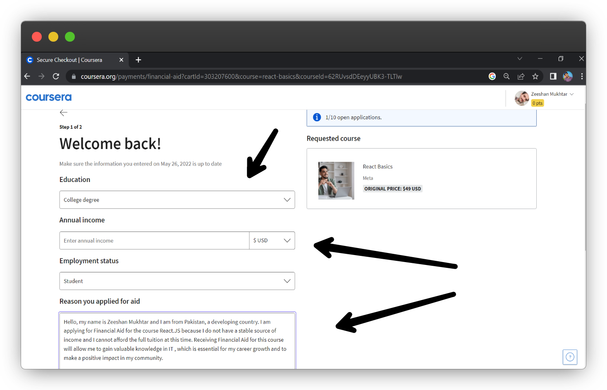
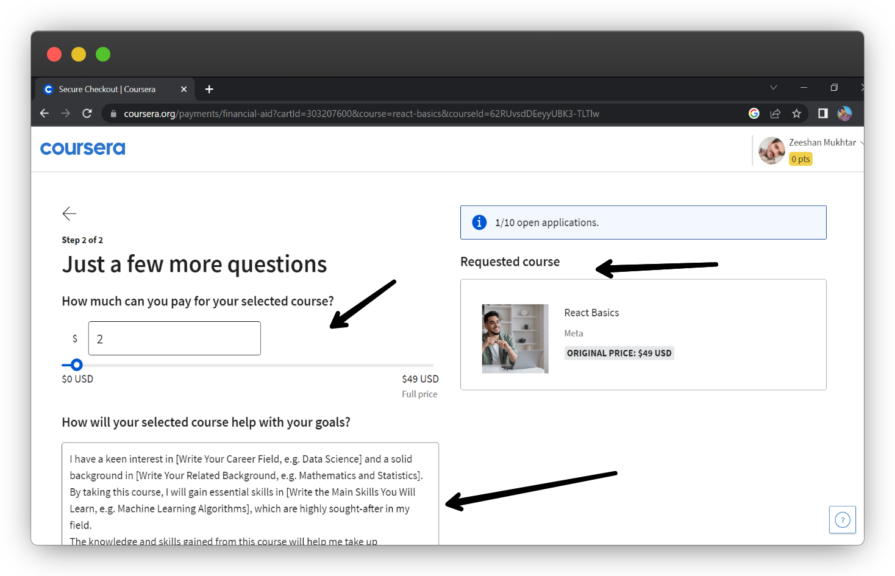
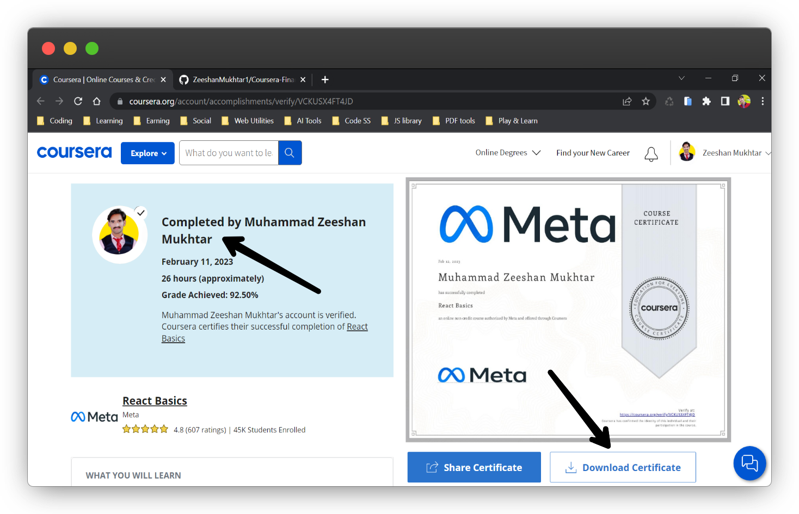

# About this Repository 🚀

Welcome to our financial aid application repository, designed to support students in applying for financial aid and scholarships on various online learning platforms. I'm [Zeeshan Mukhtar](https://www.linkedin.com/in/zeeshanmukhtar1/), the creator of this repository. Having earned a Bachelor's degree in Information Technology in Pakistan, I empathize with the financial barriers many students face when accessing education. This repository aims to offer guidance and resources to students in similar situations, with a firm belief that education should be accessible to everyone, regardless of financial circumstances.

This repository includes a financial aid application template for reference when applying for financial aid on Coursera. The template provides guidelines on each section of the application, detailing reasons for applying and explaining how the course aligns with career goals.

If you have feedback, suggestions, or contributions to improve this repository, please feel free to [reach out](https://github.com/ZeeshanMukhtar1). Let's collaborate to make education accessible to all!

Happy learning!

## Financial Aid FAQs for Coursera Courses and Specializations

**How can I apply for financial assistance on Coursera?**
To apply, create a Coursera account, enroll in the course, and find the "Financial Aid" link on the course page. Follow the instructions to submit your application.

**What is the process for applying for financial aid on Coursera?**
The process typically involves filling out an application form and providing supporting documents. The form will ask about your financial situation and why you need aid.

**What happens after I submit my financial aid application on Coursera?**
Your application will be reviewed by the financial aid team. If approved, you'll receive instructions on how to enroll. If denied, you can appeal the decision.

**Do I have to pay to re-enroll in a course if I don't complete it within 180 days?**
Yes, you'll need to pay to re-enroll if you don't complete the course within 180 days.

**Is financial aid available for all courses on Coursera?**
No, it's available for select courses. Check for the "Financial Aid" link on the course page.

**Can I apply for financial aid for multiple courses at once on Coursera?**
Yes, you can apply for aid for multiple courses simultaneously.

**How long does it take for Coursera to review my financial aid application?**
Around 15 days.

**Can my application for financial aid be rejected on Coursera?**
Yes, if rejected, you'll receive an email with an option to appeal.

**Can I audit a course on Coursera while applying for financial aid?**
Yes, you can.

**Will my future financial aid applications be affected if I don't complete a financial aid course on time?**
No, your future applications won't be affected.

## Getting Started

As part of my commitment to simplifying the financial aid application process, I've added step-by-step images to guide you through the application process for the React.js course on Coursera. Follow the instructions and apply for financial aid to unlock the opportunities that online education has to offer.

To request financial assistance for this course, provided by Meta on the Coursera platform, please locate the "Financial aid available" hyperlink, denoted with an arrow in the image below:

To proceed with your financial aid application, click on the blue button labeled "Continue" and follow the prompts to complete the application process.

In this section, enter your degree/education information, annual income, and the reason for applying, as provided in the section below. To do so, expand the arrow in the section and fill out the required information.

Please complete the text box with the response that has been previously provided in the below Section:

Once the financial aid application is submitted, you will receive an approval email within 15 days. The email will be similar to this:

After submitting the related projects to Coursera and scoring a minimum of 80%, you will receive an email with instructions on how to download your certificate.

Upon successfully completing all assignments with satisfactory grades, a completion certificate will be awarded to you. The certificate will include details such as the course name, completion date, and relevant signatures. Here is an example of what the certificate will look like.

## Applying for Financial Aid on Coursera

**Why are you applying for Financial Aid? (150 words minimum required)**
Hello, my name is [Your Name] and I am from [Your Country], a developing country. I am applying for Financial Aid for the course "[Course Name]" because I do not have a stable source of income and I cannot afford the full tuition at this time. Receiving Financial Aid for this course will allow me to gain valuable knowledge in [Write Your Career Field, e.g. Data Science], which is essential for my career growth and to make a positive impact in my community.

I have been searching for a job for a long time to earn enough money to take this course, but unfortunately, I haven't found one yet. By receiving financial aid, I will be able to focus on my studies and improve my chances of finding a job in my desired field. Additionally, taking this course will enable me to take up a paid internship and pursue other courses in the same field.

Investing in my education and career is crucial to me, but I am currently unable to do so due to my financial situation. I am hopeful that receiving financial aid for this course will help me advance my career and provide me with the necessary skills to succeed in my field.

**How will taking this course help you achieve your career goals? (150 words minimum required)**
I have a keen interest in [Write Your Career Field, e.g. Data Science] and a solid background in [Write Your Related Background, e.g. Mathematics and Statistics]. By taking this course, I will gain essential skills in [Write the Main Skills You Will Learn, e.g. Machine Learning Algorithms], which are highly sought-after in my field.
